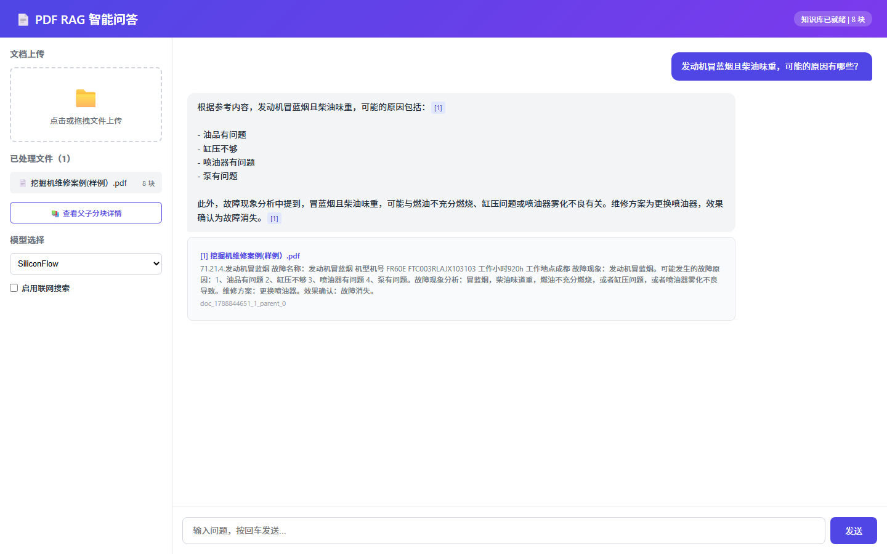
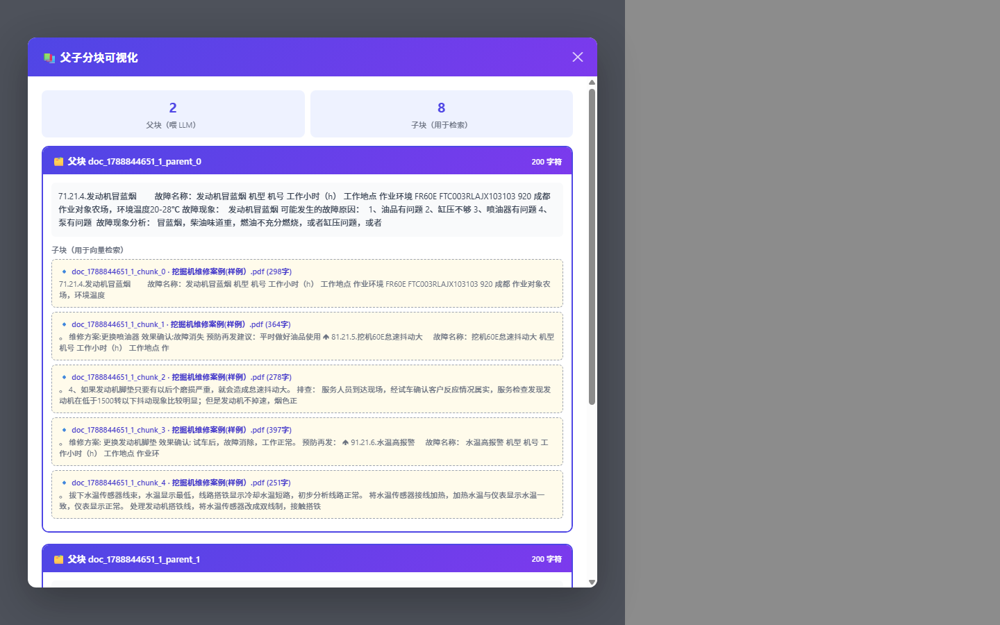
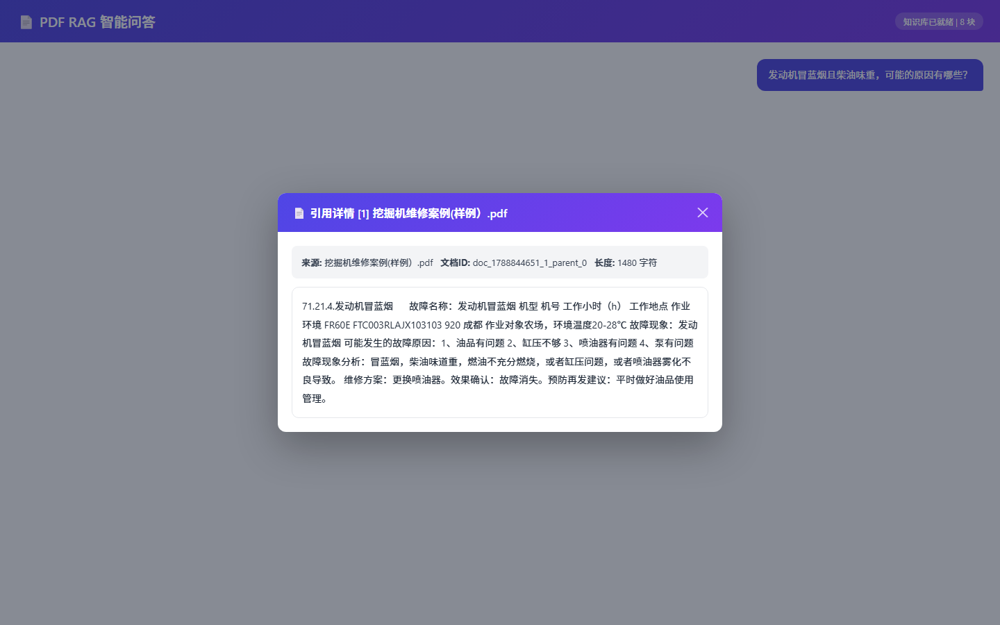

<div align="center">

# PDF RAG Enhanced

基于 **Local_Pdf_Chat_RAG** 二次开发的中文增强版检索增强生成（RAG）系统

父子女分块 · BGE 语义检索 · 引用溯源 · SSE 流式输出 · 全链路量化评测

[](https://github.com/lxxzhua/pdf-rag-enhanced/actions/workflows/ci.yml)
[](LICENSE)
[](https://www.python.org/)


</div>

---

## 一、项目背景

本项目 fork 自开源项目 [Local_Pdf_Chat_RAG](https://github.com/weiwill88/Local_Pdf_Chat_RAG)（一个面向教学场景的透明 RAG 参考实现）。上游项目解决了"能跑通"，但在**中文场景**下存在明显短板：

| 上游痛点 | 具体表现 |
|----------|----------|
| 嵌入模型英文优化 | `all-MiniLM-L6-v2` 对中文语义支持差，检索命中率极低 |
| 重排序器实现错误 | 双塔模型 `distiluse-v2` 被当作交叉编码器使用，分类头随机初始化，排序结果近乎随机 |
| 分块粒度两难 | `chunk_size=400` 小块检索准但上下文碎，大块上下文全但检索不准 |
| 来源标注脆弱 | 用正则从回答文本里"抠"来源，极易漏抓/错抓 |
| 无量化评测 | 优化效果只能"感觉"，无法度量 |
| API 阻塞 + 依赖耦合 | 问答接口阻塞式等待；API 服务被迫加载整个 Gradio |

本项目以**「评测先行、逐阶段迭代、同尺对比」**的方法论完成五个阶段的二次开发，每一步都有可复现的量化指标（见[第四节](#四优化前后指标对比)）。

## 二、核心创新点

1. **父子分块（Parent-Child Chunking）**——小块检索、大块生成的标准范式
   子块（400 字符）用于向量检索保证精度，命中后回溯父块（1500 字符、按段落边界切分）喂给 LLM 保证上下文完整性，按父块去重并控制总上下文上限（5000 字符）防止爆炸。

2. **中文语义检索全家桶**——`bge-*-zh` 嵌入 + 官方配套重排序器
   修复了上游"双塔当交叉编码器"的真 bug，换为 `BAAI/bge-reranker-v2-m3` 官方两件套；模型名全部 `.env` 可配置，CPU 场景可一键切换轻量模型（性能/精度权衡见下文）。

3. **引用溯源（Citation Traceability）**——防"假引用"的结构化标注
   检索上下文注入 `[1]..[N]` 编号并要求模型在回答中标注；回答完成后做**引用后校验**，删除指向不存在来源的编号；来源以结构化 `sources`（ref_id / 文档 / 父块全文 / doc_id）随 API 返回，前端点击 `[n]` 弹出完整父块详情。

4. **全链路量化评测体系**——13 条人工校对 QA + 检索指标脚本
   自建 `evaluation/` 模块：LLM 生成 QA 草稿 → 人工校对入库 → 脚本计算 Hit Rate@k / MRR，每个开发阶段用同一把尺子度量（`baseline_report.json` / `stage1_report.json` / `stage2_report.json` 全部入库可追溯）。

5. **生产化 API + 前端**——管线抽取、SSE 流式、会话管理
   文档处理管线抽到 `core/pipeline.py`，API 与 Gradio 彻底解耦；`/api/ask/stream` SSE 逐 token 输出；`session_id` 多轮对话记忆（TTL 自动清理）；上传接口 SSE 实时进度回调；Vue 3 前端零构建（CDN 单文件）直接渲染流式回答与结构化引用。

6. **CPU 极限性能优化**（纯 CPU 无 GPU 环境实测）
   FP16 模型加载（内存 −87%）、启动预加载（首次上传 30s+ → 2s）、轻量模型选型（编码提速 4.5 倍）、上传互斥锁防索引污染、`os.replace` 修复 Windows 覆盖语义。

## 三、界面与功能截图

**智能问答 · 流式输出 · 引用溯源**



**父子分块可视化**（父块喂 LLM / 子块用于检索，层级关系一目了然）



**引用详情弹窗**（点击回答中的 `[n]`，查看命中父块全文与元信息）



## 四、优化前后指标对比

### 检索质量（13 条人工校对 QA，同一评测脚本）

| 指标 | 基线（上游原版） | 阶段1（BGE-M3 + 重排序） | 提升 |
|------|:---:|:---:|:---:|
| **Hit Rate@1** | 7.69% | **100%** | **+92.31 pp** |
| Hit Rate@2 | 23.08% | **100%** | +76.92 pp |
| Hit Rate@3 | 61.54% | **100%** | +38.46 pp |
| Hit Rate@5 | 76.92% | **100%** | +23.08 pp |
| **MRR@5** | 0.3167 | **1.0000** | **+215.7%** |

> 阶段2（父子分块）在子块层检索，检索指标保持 100%；生成质量受益于上下文从 400 字符碎块升级为 1500 字符完整段落。

### 性能与资源（纯 CPU，无独显环境实测）

| 维度 | 优化前 | 优化后 | 手段 |
|------|--------|--------|------|
| 服务常驻内存 | 3.6 GB（FP32 加载 BGE-M3） | **472 MB**（−87%） | FP16 加载 |
| 首次上传耗时 | 30 s+（含模型懒加载） | **~2 s** | 启动时预加载 |
| 大 PDF（368 块）编码 | ~34 min（BGE-M3 @ CPU） | **~7.5 min** | 切换 `bge-base-zh-v1.5` |
| 假引用 | 无法防御 | **0** | 引用后校验删除 |
| 来源提取 | 正则抠文本 | **结构化 sources** | 溯源体系 |

> 精度/性能可配置：默认 `bge-base-zh-v1.5`（CPU 友好）；追求极致精度可在 `.env` 配置 `EMBED_MODEL_NAME=BAAI/bge-m3`（检索评测 100% 分即基于 M3）。

## 五、系统架构

```mermaid
flowchart TD
    A[文档上传<br/>PDF/Word/Excel/PPT/TXT/MD] --> B[文本提取<br/>document_loader]
    B --> C[父子分块<br/>text_splitter<br/>子块400字符·父块1500字符]
    C --> D[嵌入编码<br/>embeddings<br/>bge-base-zh-v1.5 / bge-m3]
    D --> E[(FAISS<br/>向量索引)]
    C --> F[(BM25<br/>关键词索引)]
    G[用户提问] --> H[混合检索<br/>retriever]
    E --> H
    F --> H
    H --> I[重排序<br/>bge-reranker-v2-m3]
    I --> J[父块回溯 + 去重<br/>上下文上限控制]
    J --> K[引用编号注入 [1]..[N]<br/>generator]
    K --> L[LLM 生成<br/>SiliconFlow / Ollama / OpenAI 兼容]
    L --> M[引用后校验<br/>删除假引用]
    M --> N[SSE 流式返回<br/>api_router]
    N --> O[Vue 3 前端<br/>流式渲染 + 引用弹窗 + 分块可视化]
    P[评测体系 evaluation/<br/>Hit Rate@k · MRR] -.同一把尺子度量.-> H
```

**目录结构**

```
pdf-rag-enhanced/
├── core/                  # 核心 RAG 管线（可独立替换）
│   ├── document_loader.py # 文本提取（PDF/Word/Excel/PPT/TXT/MD）
│   ├── text_splitter.py   # 父子分块 split_parent_child()
│   ├── embeddings.py      # 嵌入编码（FP16、query 指令适配）
│   ├── vector_store.py    # FAISS + 父块映射 + 分块可视化
│   ├── bm25_index.py      # BM25 关键词索引
│   ├── retriever.py       # 混合检索 + 父块回溯去重
│   ├── reranker.py        # 交叉编码器重排序
│   ├── generator.py       # prompt 构建 + 引用校验 + 流式生成
│   └── pipeline.py        # 文档处理管线（UI/API 共用）
├── api_router.py          # FastAPI 服务（SSE 上传/问答、会话管理）
├── rag_demo.py            # Gradio 界面
├── frontend/              # Vue 3 CDN 单文件前端
├── evaluation/            # 评测：QA 数据集 + 检索指标 + 报告
├── tests/                 # pytest 测试
└── images/                # 截图
```

## 六、技术栈

| 层 | 技术 |
|----|------|
| 语言 | Python 3.10+ |
| 嵌入/重排序 | SentenceTransformers · `BAAI/bge-base-zh-v1.5`（默认）/ `BAAI/bge-m3` · `BAAI/bge-reranker-v2-m3` |
| 向量/关键词检索 | FAISS · BM25（rank_bm25 + jieba） |
| 生成后端 | SiliconFlow / Ollama / OpenAI 兼容 API |
| Web 服务 | FastAPI + Uvicorn（SSE 流式） |
| 前端 | Vue 3（CDN 免构建单文件） |
| 桌面 UI | Gradio 6.x |
| 文档解析 | pypdfium2 / python-docx / openpyxl / python-pptx |
| 评测/工程化 | pytest · GitHub Actions CI · JSON 指标报告 |

## 七、部署步骤

```bash
# 1. 克隆
git clone https://github.com/lxxzhua/pdf-rag-enhanced.git
cd pdf-rag-enhanced

# 2. 创建虚拟环境（Windows）
python -m venv PDF-RAG
.\PDF-RAG\Scripts\Activate.ps1

# 3. 安装依赖
pip install -r requirements.txt

# 4. 配置密钥（可选功能按需填写）
copy example.env .env   # 编辑 .env 填入 SILICONFLOW_API_KEY 等

# 5. 启动 API 服务（含前端，模型启动时预加载约 15~30s）
python api_router.py
# 浏览器访问 http://localhost:17995/
```

可选：Gradio 桌面 UI（`python rag_demo.py`）、评测复现（`python evaluation/run_eval.py --output evaluation/my_report.json`）、测试（`pytest -q`）。

**`.env` 常用配置**

```ini
SILICONFLOW_API_KEY=sk-xxx        # 云端 LLM
EMBED_MODEL_NAME=BAAI/bge-base-zh-v1.5   # 换 BAAI/bge-m3 追求最高检索精度
RERANKER_MODEL_NAME=BAAI/bge-reranker-v2-m3
```

## 八、API 一览

| 方法 | 路径 | 说明 |
|------|------|------|
| POST | `/api/upload` | 文档上传（**SSE 实时进度**） |
| POST | `/api/ask` | 阻塞式问答 |
| POST | `/api/ask/stream` | **SSE 流式问答**（逐 token + 结构化 sources） |
| GET | `/api/chunks` | 父子分块可视化数据 |
| GET/DELETE | `/api/session/{id}` | 会话历史查询 / 删除 |
| GET | `/api/status` | 服务与知识库状态 |

## 九、已知限制与后续规划

- 纯 CPU 环境下大文档编码仍需分钟级（上 GPU 可提速 50 倍以上）
- 向量库为内存态，重启后需重新上传（FAISS 持久化在规划中）
- 生成层评测（RAGAS Faithfulness / Context Precision）待接入
- 当前检索评测基于单一维修案例文档，评测集将持续扩充

## 十、致谢

- 上游项目：[Local_Pdf_Chat_RAG](https://github.com/weiwill88/Local_Pdf_Chat_RAG)（951+ stars 的 RAG 教学参考实现）
- 模型：[BAAI](https://huggingface.co/BAAI)（bge 系列）、[SiliconFlow](https://siliconflow.cn/)（推理服务）

## License

MIT
